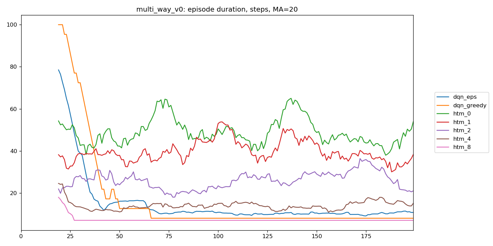
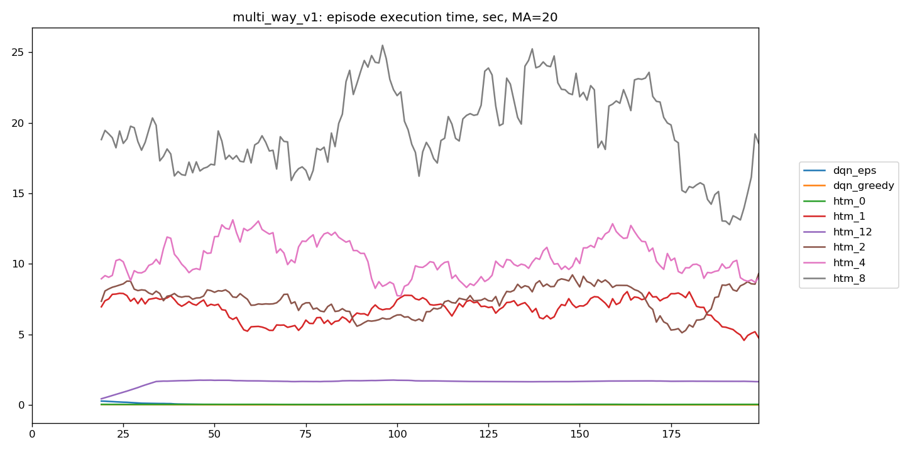
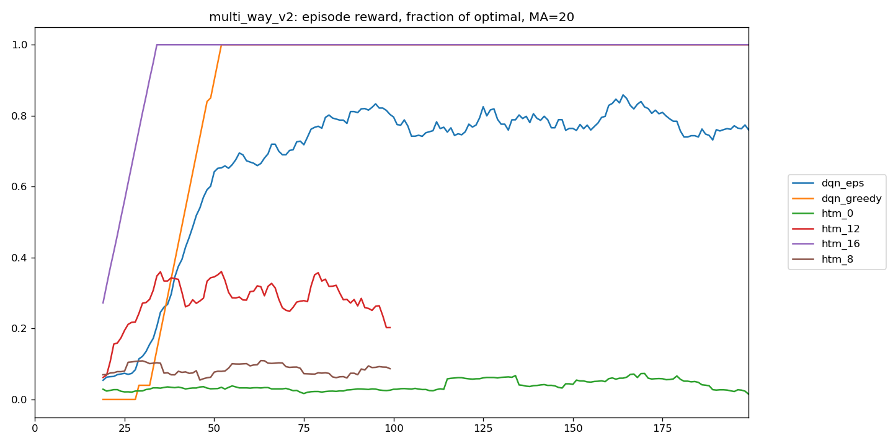
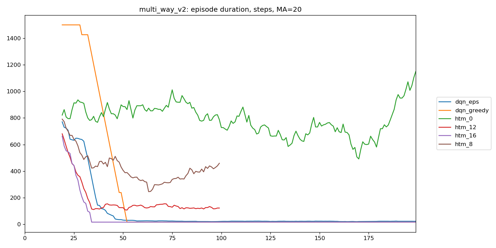

# FAQ

- [FAQ](#faq)
  - [Agent](#agent)
    - [Планировщик. Шаг 1: планирование до награды](#планировщик-шаг-1-планирование-до-награды)
    - [Планировщик. Шаг 2: нахождение обратного пути](#планировщик-шаг-2-нахождение-обратного-пути)
    - [Планировщик. Шаг 3: проверка найденного пути](#планировщик-шаг-3-проверка-найденного-пути)
    - [Тестирование](#тестирование)
      - [multi_way_v0](#multi_way_v0)
      - [multi_way_v1](#multi_way_v1)
      - [multi_way_v2](#multi_way_v2)
    - [Выводы](#выводы)
  - [Terminology](#terminology)
  - [Encoding](#encoding)
  - [Parameters](#parameters)
    - [Currently in use](#currently-in-use)
    - [Adviced by Numenta community](#adviced-by-numenta-community)
  - [Planning](#planning)
    - [Pseudocode](#pseudocode)
    - [Step 1: Forward prediction](#step-1-forward-prediction)
    - [Step 2: Backtracking](#step-2-backtracking)
    - [Step 3: Re-check](#step-3-re-check)

## Agent

Агент играет в среде GridWorld - лабиринт на квадратной сетке. Агент начинает игру в фиксированной точке старта, и ему требуется найти единственную награду, которая находится в фиксированном месте.

В каждый момент времени агент находится в некоторой клетке лабиринта, указывая лицом одно из 4х направлений: восток, север, запад, юг. Из текущего состояния он может либо шагнуть прямо в соседнюю клетку, либо повернуться на 90 градусов против часовой стрелки. Опционально в среде может быть разрешено третье действие - поворот на 90 градусов по часовой стрелке (по умолчанию запрещено). Переходы между состояниями однозначны, т.е. среда описывается детерминированным MDP. Когда агент пытается шагнуть "в стенку", он остается на месте.

Текущая реализация агента содержит, грубо говоря, две политики - случайную и спланированную. Спланированную политику предоставляет планировщик. В случае, если он не может представить политику, применяется случайная.

Таким образом основная логика агента содержится в реализации планировщика.

Задача планировщика - найти путь до награды, если она достижима за не более чем `planning_horizon` шагов. Он это делает в три этапа:

1. Планирование до награды из текущего
2. Нахождение обратного пути из состояния с наградой в текущее
3. Проверка найденного пути

Чтобы агент мог планировать, он наделен памятью для запоминания увиденных переходов между состояниями, которая эмулирует функцию динамики среды $f: (s, a) \rightarrow (s', r)$. При этом память агента имеет некоторые особенности.

Главная особенность - она способна работать с суперпозициями (=множествами). Это означает, что память может отвечать на запросы вида _имея набор состояний $\{s_i\}$ и набор действий $\{a_j\}$, в какие состояния $\{s'_m\}$ и награды $\{r_n\}$ могут привести все возможные пары $(s_i, a_j)$_? В ответ на такой запрос память возвращает суперпозицию следующих состояний и наград.

Вторая особенность - для каждого конкретного состояния $s'$ из суперпозиции в ответе на запрос к памяти есть возможность узнать $(s, a) = f^{-1}(s')$

На основе этих двух особенностей и построен алгоритм планировщика.

### Планировщик. Шаг 1: планирование до награды

Допустим, в текущий момент времени агент находится в состоянии $s_0$. Чтобы ответить на вопрос, есть ли достижимая награда в радиусе $N$ действий, начнем планировать из суперпозиции $(s_0, A)$, где $A$ - все множество доступных действий агента.

После первого шага предсказания мы будем иметь множество состояний $\{s_i\}^1$, в которые можно попасть из текущего за одно действие агента. Продолжим планировать из суперпозиции этих состояний так же по всем возможным действиям. И так далее до тех пора пока либо не обнаружим состояние с наградой, либо не исчерпаем лимит горизонта планирования $N$ = `planning_horizon`.

Если награда найдена, то планировщик переходит к следующему этапу.

### Планировщик. Шаг 2: нахождение обратного пути

Итак, на текущий момент, планировщик уверен, что награда может быть достигнута за $T$ шагов, но пока что не знает как - на первом этапе мы работали с суперпозициями и использовали все возможные действия, поэтому какие конкретно действия привели к награде неизвестно.

На момент окончания успешного планирования до награды за $T$ шагов, имеем всю историю суперпозиций состояний на каждом из этих шагов $[s_0, \{s_i\}^1, .. \{s_i\}^t]$.

По найденной награде планировщик выбирает пару состояние-действие $(s^{T-1}, a^{T-1}) = f^{-1}(r)$, которые привели к ней. Таким образом для предпоследнего шага известно требуемое действие $a^{T-1}$ и состояние $s^{T-1}$, в которое нужно прийти.

Далее рекурсивно повторяем процедуру, на каждом шаге $t$ находя пару состояние-действие $(s^{t-1}, a^{t-1}) = f^{-1}(s^t)$, пока не вернемся в начальную позицию $s^0 = s_0$.

Здесь, правда, стоит уточнить, что $f^{-1}$ в общем случае возвращает не единственную пару $(s, a)$, а множество пар, и не всякая пара рекурсивно приведет нас обратно в начальную позицию. Поэтому рекурсивно проверяются все пары до первого успешного возвращения.

Если процесс нахождения обратного пути завершился успешно, планировщик переходит к последнему третьему этапу

### Планировщик. Шаг 3: проверка найденного пути

По завершению второго этапа планировщик не только уверен в достижимости награды, но и имеет последовательность действий $[a_0, a_1, ..., a_{T-1}]$, которые приведут агента к награде.

На этом этапе планировщик проводит серию предсказаний, аналогичных шагу 1. Только теперь на каждой итерации предсказание ведется по единственной паре $(s^t, a^t) \rightarrow (s', r)$. Проверка проводится относительно того, приведет ли найденная последовательность действий к награде.

В случае успеха планировщик имеет политику действий на $T$ шагов вперед, которую агент безусловно выполняет. В случае успеха агент находит награду, и эпизод завершается, иначе агент пытается заново спланировать действия.

### Тестирование

Тестирование агента проводилось на трех средах типа GridWorld.

Для каждой среды награда считается по отношению к идеальной стратегии: $R = \frac{N_{opt}}{N}$, где $N_{opt}$ - число действий при оптимальной стратегии, $N$ - число действий агента. Т.е. за эпизод агент получает награду $R \in [0, 1]$, причем $1$ - только если играет идеально. Если агент не достиг награды за эпизод, то награда равна нулю.

Агент тестировался относительно разных горизонтов планирования. В легенде к графикам, например, `htm_1` обозначает агента с горизонтом планирования 1, а `htm_4` - с горизонтом планирования 4. Также агент тестировался относительно бейзлайнов - рандомной стратегии и DQN.

Рандомная стратегия бралась в качестве агента с нулевым горизонтом планирования, поэтому на графиках он под меткой `htm_0`. Для DQN на графиках представлены результаты обеих стратегий - жадной и $\epsilon$-жадной, обозначаемых как `dqn_greedy` и `dqn_eps` соответственно.

Ниже к каждой среде приведены результаты рассматриваемых агентов. В качестве результатов приведены графики награды за эпизод, количества шагов за эпизод и времени выполнения одного эпизода (в секундах). На всех графиках изображена скользящая средняя с окном, указанным в заголовке графика (например, `MA = 20`)

Легенда к схемам тестовых сред:

- `-` пустая клетка,
- `#` стена,
- [`<`,`^`,`.`,`>`,] агент с направлением его взгляда (лево, верх, низ, право),
- `X` награда

#### multi_way_v0

```bash
#####
#>--#
#-#-#
#--X#
#####
```

Оптимальная политика данной среды содержит 7 действий.





#### multi_way_v1

```bash
#######
#>--###
#-#-###
#-----#
###-#-#
###--X#
#######
```

Оптимальная политика - 12 действий.



  
#### multi_way_v2

```bash
#########
#---#####
#-#-#####
#-->---##
###--####
###-#--X#
###---###
###-#####
#########
```

Оптимальная политика - 16 действий.





### Выводы

Ключевые выводы:

- Чем больше горизонт планирования, тем лучше агент играет
  - причем улучшение кумулятивно, т.е. каждый следующий +1 горизонта дает больший прирост, чем предыдущий
- Агент с планированием играет лучше, чем случайный
  - чем сложнее среда, тем менее заметен в относительных масштабах переход от horizon_planning=0 к horizon_planning=1
  - т.е. при фиксированном горизонте планирования с увеличением сложности среды результат в относительных масштабах начинает прижиматься к результатам случайного агента
- Агент учится очень быстрее, чем DQN
- Если горизонта планирования достаточно, то агент очень быстро начинает решать задачу планирования идеально, достигая оптимальной стратегии
  - в таком случае агент учится заметно быстрее DQN - ~1.5-2.5 раньше начинает решать задачу идеально
- Но для любого фиксированного горизонта, если начать усложнять среду, то в какой-то момент DQN обгонит по результатам
  - потому что DQN решает задачу [почти всегда] оптимально, а htm агент только в случае достаточного горизонта планирования
- Случай субоптимального решения
  - горизонта планирования достаточно для субоптимального решения из начальной точки
  - имеется несколько длинных узких "ходов" до цели, имеющих примерно одинаковую длину
  - тогда есть ненулевая вероятность, что агент не успеет запомнить путь через оптимальный коридор и будет планировать только через субоптимальный.

## Terminology

SAR

- In short: tuple (state, action, reward)
- Given trajectory: $(s_0, a_0, r_1, s_1, a_1, r_2, s_2, a_2, ...)$
- $sar_t = (s_t, a_t, r_t)$
  - $sar_t$ is centered around the current state $s_t$
  - has reward $r_t$ given for getting __to__ this state
  - has action $a_t$ taken __from__ this state.
  - NB: so actually it's better be called RSA, but it's still called SAR
  - Edge cases are
    - reward $r_0$ for initial state is 0
    - action $a_T$ for terminal state is whatever you want
- TM accepts SAR encoded to SDR as [proximal] input
  - __Important:__ I call SAR encoded to SDR as SAR SDR, but
  - as conversion is straightforward both ways
  - I often just call it SAR when it's obvious or doesn't matter
- TM remembers SAR sequences: $(sar_0, sar_1, ... )$

SAR Superposition

- Union of any number of SAR
  - For SDR format it's a bitwise OR of corresponding SAR SDRs
- Why it's even needed
  - TM works with SAR superpositions both as input and output
  - For any particular SAR it predicts all possible next SARs
    - they represented as union
    - i.e. they can't be separated into single SARs
    - hence SAR superposition
  - TM accepts SAR superpositions as input as well
    - I think it's obvious
- Even though TM remembers SAR sequences
  - Depolarization in general: active SDR $\rightarrow$ depolarized SDR
  - For SARs: active SAR superposition $\rightarrow$ depolarized SAR superposition

## Encoding

SAR SDR encoder

- Encodes SAR to SDR
- Uses separate state, action and reward SDR encoders
  - Resulting SDRs are concatenated
- I consider only discrete environments
  - Hence both states and actions are discrete sets
  - Rewards are discrete too: $r \in \{0, 1\}$
- So states, actions and rewards can be represented as integer numbers
  - i.e. $s_t \in [0, |S|)$ and $a_t \in [0, |A|)$
  - for this Integer SDR encoder is used

Integer SDR encoder

- Encodes integer numbers from [0, `n_values`) to SDR
- Parameters:
  - `n_values` - size of the range, i.e. it's a number of unique values
  - `value_bits` - how many bits are used to encode every unique value
- Resulting SDR has `n_values` $\times$ `value_bits` bits
  - called `total_bits`
  - it can be logically divided into `n_values` buckets of `value_bits` contiguous bits
    - each bucket corresponds to a value from the range
  - e.g. 2 $\rightarrow$ `0000 0000 1111` encoded by 3-by-4 integer encoder
    - 3 buckets are separated by space to make it clear
    - every bucket encoded by 4 bits
    - note that buckets don't intersect
- PROS
  - Easy to encode/decode
  - Easy to debug
  - Easy to pretty print
- CONS
  - Cuts out information about states similarity
    - as different values have no intersection
  - You have no direct control on sparsity, which is `1 / n_values`
    - you may have problems with too low or too high sparsity levels
    - it tested that TM works well with low sparsity
      - which doesn't mean it has not negative effects at all
    - just remember that sparsity may lead to problems

State SDR encoder

- For the most simple MDP environments we use integer encoding
  - because it's very good for debugging
- For complex environments encoding states [or observations] becomes tricky
  - Of course, you still can enumerate all possible states and use Integer SDR encoder
  - But the number of all possible states grows very fast
    - so in practice it works well only for small environments
  - Also Integer SDR encoder cut out information about states similarity
- One possible solution is to encode every pixel [or grid cell] separately then concatenate results
  - It preserves information about similarity between states

## Parameters

### Currently in use

**SAR encoder**:

- `n_values`: (>=3, 2, 2)
- `value_bits`: 24
- `activation_threshold`: 21
- Derived params or attributes
  - `total_bits`: >=56
  - `sparsity`: ~15-35%

Rationale

- `n_values`
  - определяется числом уникальных состояний/наблюдений
  - опробованы среды с n_values 3-100
- `value_bits`
  - рекомендовано >= 20
  - каждая часть SAR - по 8 активных бит, в сумме 24
- `activation_threshold`
  - = _value_bits_ - 3
  - __очень важная характеристика__
  - каждой части SAR задается свой activation_threshold = *value_bits* - 1 = 7
    - порог активации одной части SAR, т.е. state/action/reward
    - -1 оставляется под шум (=12.5% шума для 8 бит) и близкие значения
    - в сумме на три части: -3
    - спорное решение - вместо суммы должен браться максимум?
  - т.к. на вход приходят данные от кодировщика, который разным значениям дает не пересекающиеся векторы, выбор порога пока не так важен и актуален

**Temporal Memory**:

- `n_columns`: >= 56
- `cells_per_column`: 1 or ??
- `activation_threshold`: 21
- `learning_threshold`: 17
- `initial_permanence`: 0.5
- `connected_permanence`: 0.4
- `permanenceIncrement`: 0.1
- `permanenceDecrement`: 0.05
- `predictedSegmentDecrement`: 0.0001
- `maxNewSynapseCount`: 24
- `maxSynapsesPerSegment`: 24

Rationale:

- `n_columns`
  - = *sar.total_bits*
- `cells_per_column`
  - для MDP достаточно first-order memory
  - для POMDP нет данных
- `activation_threshold`
  - = *sar.activation_threshold* = 21
- `learning_threshold`
  - = 85% \* *sar.activation_threshold* = 17
  - есть нижний порог: *action.value_bits* + *reward.value_bits* = 8 + 8 = 16
    - именно такое ложно положительное пересечение встречается регулярно
    - например, SAR вида (x, 0, 0) пересекаются в 16 битах, но не имеют ничего общего, потому что вся уникальность только в состоянии
    - при этом штрафовать такие пересечения нельзя
    - следовательно learning_threshold должен быть > 16
- `initial_permanence`
  - начальное значение при создании синапса
  - абсолютное значение initial_permanence не важно
- `connected_permanence`
  - порог, определяющий синапс connected или нет
    - только connected синапсы могут активировать сегмент
  - разница между initial и connected может иметь значение
    - и как она соотносится с параметрами обучения
    - сделать их равными - хороший вариант по умолчанию
  - нужно изучать отдельно
- `permanenceIncrement`
  - имеет значение, нужно изучать
- `permanenceDecrement`
  - рекомендуется брать в 2-3 раза меньше инкремента (точно? почему?)
- `predictedSegmentDecrement`
  - рекомендуется брать _permanenceIncrement_ * sparsity
    - логика рекомендации от Numenta в текущем виде не очень применима
    - т.к. входные векторы имеют перекошенную энтропию
  - нужно тестировать отдельно
- `maxNewSynapseCount`
  - = *sar.value_bits* = 24
  - плохо понимаю важность этого параметра
  - по идее имеет смысл делать его как минимум *activation_threshold*, чтобы новый сегмент сразу смог активироваться паттерном (иначе мало синапсов)
  - ну и бессмысленно делать его больше *maxSynapsesPerSegment*
- `maxSynapsesPerSegment`
  - = *sar.value_bits* = 24
  - оказалось, что это очень важный параметр
  - очевидно, нижний порог: *activation_threshold*
  - не очевидно, верхний порог: *sar.value_bits*
    - каждый сегмент должен распознавать ровно один SAR (отсюда верхний порог)
    - если он способен распознавать больше одного SAR, то они интерферируют
    - это очень сильно мешает при бэктрекинге
    - с другой стороны это ведет к большому числу сегментов, по сути мы запоминаем все переходы
    - с этим придется разбираться в будущем

### Adviced by Numenta community

**Spatial Pooler**:

- `n_colunms`: >= 2000
  - more is better
  - similarity metric - overlap
    - different "values" => low overlap score
    - similar "values" => high overlap score
  - so, there should be enough columns to distinguish levels of similarity, given some noise
- `sparsity`: 2%
  - how many bits are active
  - ok: 1-10%
  - `n_active_bits` should be >= 20
  - TODO: add equations from numenta paper

**Temporal Memory**:

- `n_columns`: >= 2000
  - same as for Spatial Pooler
- `cells_per_column`: 8
  - defines number of different ways context is represented (grows exponentially)
- `activation_threshold`
  - number of active synapses enough for segment activation
  - = *n_active_bits* - R
    - expected number of active columns
    - minus some accepted similarity radius R (or noise)
- `learning_threshold`
  - ??
- `initial_permanence`: 0.5
- `connected_permanence`: 0.5
- `permanenceIncrement`: 0.1
- `permanenceDecrement`: 2-4 times smaller than *permanenceIncrement*
- `predictedSegmentDecrement`: *activation_threshold* \* *sparsity*
  - used to punish on reaching *learning_threshold*
- `maxNewSynapseCount`: 32
- `maxSynapsesPerSegment`: 255

## Planning

Initial: agent is in state $s_0$  
Goal: find a sequence of actions leading to reward from initial state $s_0$ if it's possible with $n_max$ steps

Planning consists of 3 main phases:

- Forward prediction phase - predict every possible outcomes until reward (= rewarding state) is found
- Backtracking phase - backward unrolling predictions from reward
- Re-check phase - check that backtracked sequence of transitions is correct

### Pseudocode

Псевдокод алгоритма планирования:

```python
def plan_actions(initial_sar: Sar):
    # Step 1: Forward prediction
    active_segments_timeline = predict_to_reward(initial_sar)

    # Step 2: Backtrack from reward
    activation_timeline = backtrack_from_reward(active_segments_timeline)

    # Step 3: Forward-check backtracked activations
    planned_actions = check_activation_timeline_leads_to_reward(
        initial_sar, activation_timeline
    )

    return planned_actions
```

Первый шаг - предсказание награды:

```python
def predict_to_reward(initial_sar: Sar):
    # Start prediction with all possible actions
    initial_sar.action = encoder.AllValues
    proximal_input = agent.encoder.encode(all_actions_sar)

    active_segments_timeline = []
    for i in range(max_steps):

        if is_rewarding(proximal_input):
            return active_segments_timeline

        active_cells, depolarized_cells = agent.process(
            proximal_input, learn=False
        )

        active_segments_t = agent.active_segments(active_cells)
        active_segments_timeline.append(active_segments_t)

        proximal_input = columns_from_cells(depolarized_cells)
```

Второй шаг - рекурсивный бэктрекинг из столбцов, соответствующих награде, назад во времени:

```python
def backtrack_from_reward(active_segments_timeline):
    final_depolarized_cells = active_segments_timeline[T-1].keys()
    depolarized_reward_cells = get_reward_cells(final_depolarized_cells)

    return backtrack(depolarized_reward_cells, T-1)


def backtrack(desired_depolarization: SparseSdr, t: int):
    # presynaptic cells clusters, each can induce desired depolarization
    cell_clusters = get_backtracking_candidate_clusters(
        desired_depolarization, activation_threshold, t
    )

    for cluster in cell_clusters:
        activation_timeline = backtrack(cluster, t-1)
        if backtracking_succeeded:
            activation_timeline.append(cluster)
            return activation_timeline
```

Откуда берутся кластеры-кандидаты:

```python
def get_backtracking_candidate_clusters(
        desired_depolarization: SparseSdr,
        sufficient_activation_threshold: int,
        t: int
):
    # Active presynaptic cell clusters (clusterization by columns)
    active_segments = active_segments_timeline[t][desired_depolarization]
    candidate_clusters = merge_segments_into_clusters(active_segments)

    # Keep clusters that induce sufficient depolarization among desired
    for cluster in candidate_clusters:
        count_induced_depolarization(cluster, desired_depolarization)

        if induced_depolarization >= sufficient_activation_threshold:
            backtracking_candidate_clusters.append(cluster)

    return backtracking_candidate_clusters
```

Последний шаг - предсказание награды по пути успешного бэктрекинга:

```python
def check_activation_timeline_leads_to_reward(
        initial_sar: Sar, activation_timeline
):
    proximal_input = encoder.encode(initial_sar)

    for i in range(T):
        action = extract_action(activation_timeline[i])
        proximal_input.action = action

        active_cells, depolarized_cells = agent.process(
            proximal_input, learn=False
        )
        proximal_input = columns_from_cells(depolarized_cells)

        planned_actions.append(action)

    if is_rewarding(proximal_input):
        return planned_actions
```

### Step 1: Forward prediction

Setting up

- Given initial state $s_0$
- To find a reward, I want to check all possible paths, starting from $s_0$
  - Then SAR superposition  
    (state = $s_0$, {all actions}, reward = 0)
  - .. represents all possible beginnings of these paths
  - So, encode it to SDR and set it as initial proximal input to TM

Forward prediction

- Given some SAR superposition as proximal input at time $t$
  - induces cells activation
- TM prediction: some SAR superposition at time $t+1$
  - prediction is in form of depolarized cells
- Save all active segments (discussed later in section)
- Check if depolarized SAR superposition contains reward = 1
- Continue forward prediction by taking predicted SAR superposition as input at $t+1$
  - until reward is found
  - or max forward steps are done

A bit of details on TM work, step by step:

- Given current proximal input [at time $t$]
- It directly induces columns activation
- Active columns [and depolarization from $t-1$] induce cells activation
  - any depolarized cell in active columns becomes active
  - or all cells become active if active column has no depolarized cells (bursting)
- Cells activation induces segments activation
  - number of active presynaptic cells $\geq$ activation threshold
- Segments activation induces cells depolarization
  - any active segment depolarizes its postsynaptic cell
- Depolarized cells can be collapsed into depolarized columns
  - any depolarized cell depolarizes its column
- Depolarized columns define predicted SAR SDR superposition [at time $t+1$]

What is saved during forward prediction phase:

- At each time step $t$ there's a set of segments that are active
- These active segments are saved into `active_segments_timeline[t]`
  - as dictionary: `depolarized_cell` $\rightarrow$ `cell_active_segments_list`
  - `cell_active_segments_list` - list of cell's active segments
  - each active segment represented as a set of active presynaptic cells

### Step 2: Backtracking

Backtracking step

- Given a set of depolarized cells `dep_cells` [at time $t$]
- Call active segment as _potential_ if it induces enough depolarization among `dep_cells`
  - _ehough_ means $\geq$ activation threshold
  - i.e. a number of depolarized cells will be enough for subsequent depolarizations
- Take presynaptic active cells of a potential segment as depolarized cells [at time $t-1$]

Backtracking algorithm

- Start from depolarized cells in reward = 1 columns [at time T]
- Recursively take backtracking steps for any potential segment until time 0 is reached

Details

- Given a set of depolarized cells `dep_cells` [at time $t$]
  - Each depolarized cell have at least one active segment
  - Each active segment is associated with a set of active presynaptic cells
    - This set defines some SAR SDR
    - i.e. each segment is conditioned on some correct SAR
- I want to find all potential sets of active presynaptic cells that induce enough depolarization of `dep_cells`
  - perfect case
    - `dep_cells` conditioned on the same SAR
    - i.e. this SAR induces full `dep_cells` depolarization
  - perfect multiple case
    - `dep_cells` conditioned on more than one SAR
    - i.e. each of these SAR induces full `dep_cells` depolarization
- real world relaxations
  - some SARs don't induce enough depolarization
    - i.e. $\lt$ threshold
  - segments don't exactly match each other
    - cells are conditioned on very similar SARs but not exactly the same

What is saved during this phase

- active [presynaptic] cells at time $t$ are saved as `backtracking_SAR_conditions[t]`
- they define condition on SAR at time $t-1$ to get desired depolarization at time $t$

### Step 3: Re-check

- Given active presynaptic cells at time $t$ needed to induce desired depolarization
- Start forward prediction again from initial sar superposition
- But now
  - Check that SAR `backtracking_SAR_conditions[t]` is consistent with the current active SAR
  - Extract action $a_t$ from `backtracking_SAR_conditions[t]`
  - Action $a_t$ defines a path to make at time $t$
  - Replace action superposition in proximal input with $a_t$
- Check that given `backtracking_SAR_conditions` lead to reward
