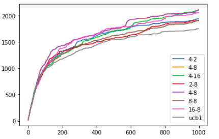

# Research and development log

- [Research and development log](#research-and-development-log)
  - [TODO](#todo)
  - [Thoughts and ideas](#thoughts-and-ideas)
  - [2020.11.27 Fri](#20201127-fri)
  - [2020.11.20 Fri](#20201120-fri)
  - [2020.11.06 Fri](#20201106-fri)
  - [2020.10.23 Fri](#20201023-fri)
  - [2020.10.19 Mon](#20201019-mon)
  - [2020.10.09 Fri](#20201009-fri)
  - [2020.10.02 Fri](#20201002-fri)
    - [MCTS ideas](#mcts-ideas)
    - [Bandits experiment](#bandits-experiment)
      - [Approaches to accumulate UCB1 sum terms Q and U](#approaches-to-accumulate-ucb1-sum-terms-q-and-u)
  - [2020.09.25 Fri](#20200925-fri)
  - [2020.09.18 Fri](#20200918-fri)
  - [2020.09.06 Sun](#20200906-sun)
  - [2020.08.08 Sat](#20200808-sat)
    - [TM related interesting links](#tm-related-interesting-links)
    - [Gridworld transfer learning experiment](#gridworld-transfer-learning-experiment)

## TODO

**Urgent**:

- [x] add ruamel.yaml to requirements
- [x] describe config based building details - conventions and implementation
- [x] describe run arguments
- [x] update FAQ part on Terminology, Encoding, Planning, Parameters
- [ ] add pytorch, tdqm to requirements
- [ ] mention vs code setup for markdown

Research + functional tasks

- [x] Adapt planning to goal-based strategy
  - [x] Switch from reward-based planning to goal-based
    - [x] Cut out reward from encoding and memorizing
    - [x] Track history of rewarding states and plan according to any of them
      - add naive list-based rewarding states tracking
  - [x] Test transfer learning capabilities
    - [x] Adapt environments for random initial states
    - [x] Adapt environments for random rewarding states
    - [x] Make the set of testing environments
    - [x] Adapt test runners for a multi-environment tests
    - [x] Make config for an experiment
    - [x] Run experiments
  - [x] Report results
    - [x] Update method description
    - [x] Add experiment results
    - [ ] TBD
- [ ] Deal with high variance of results and the need to use large moving average windows
- [ ] MCTS
  - [ ] Make sure update cell ratio is used properly
- Not acknowledged and questionable:
  - [ ] Split SAR TM into 2 TMs
    - State TM: (s, a) $\rightarrow$ s'
    - Action TM: s $\rightarrow$ a
    - Direct external rewards aren't a thing
    - Reinforcement isn't tracked ATM
  - [ ] Investigate `MaxSegmentsPerCell` parameter impact
  - [ ] Implement integer encoder w/ overlapping buckets
    - overlapping should be a parameter
    - it defines the level of uncertainty
    - MDP planning becomes a light version of POMDP planning because of uncertainty
  - [ ] Investigate relation between overlapping and sufficient activation thresholds
  - [ ] Investigate `MaxSynapsesPerSegment` parameter impact
  - [ ] Start testing on POMDPs

Non-critical issues needing further investigation

Auxialiary tasks, usability improvements and so on

- [x] config based tests
  - [x] test config + builder classes
  - [x] improve config based building:
    - one config file for one test run (=all agents one test)
    - or even one config file for the whole experiment (=all agents all tests)
- [x] fine grained trace verbosity levels
- [x] setup release-based dev cycle
  - add tagging to git commits
  - how to add release notes
  - ?notes for major releases should contain algo details from FAQ
- [x] release v0.1 version of the SAR-based agent
- [ ] for v1.x
  - [ ] ? gym-like env interface
  - [ ] ? refactor envs and env generators (naming, names)
  - [ ] start live-logging
- [ ] for v2.x
  - [ ] remove legacy SAR-based parts
- [ ] extend Quick intro based on recent experience with students
  - [ ] add task on SP to the Readme
    - [x] fix entropy formula
    - [ ] add questions and requirements to test that learning is working
    - [ ] the same for boosting
  - [ ] update intro to TM part
    - [ ] mini-task on prediction
    - [ ] mini-task on backtracking

## Thoughts and ideas

- consider using SP between an input and TM
  - only states need SP, because actions and reward are just ints (naive encoding is enough)
  - concat them together
  - it will take care of sparsity
  - maybe smoothes the difference in size for a range of diff environments
    - bc even large envs may have a very small signal
- consider TD($\lambda$)-based approach from Sungur's work
- split SAR-based TM into State TM + Action TM
  - both has apical connections to each other
  - reward or goal-based approach? Could be interchangeable
- goal-based hierarchies of TM blocks
- SP hierarchies for large input images
  - with every SP working similar to convolution filter
- consider doing live-logging experiments in markdown there

## 2020.11.27 Fri

- Petr
  - MCTS experiments: custom coloring, then random coloring
    - it works, while not without problems and not that easily sometimes
    - but the main result is __this idea in general works well__
    - TM hyperparameters finetuning is needed each time
    - thought about using SP to lessen the input and make it more distinguishable while keeping semantics
  - played with algo upgrades
    - windowed stats
    - state predictions without actual using of TM
  - long before, I thought of using action bits to estimate advantage
    - but problem was that action bits are context independent (in 1st order TM)
    - we can try to tackle this problem with high order TM
    - still, I don't like this idea that much
    - but then another idea came to my mind - to use SP making action bits context dependant
  - now I'm trying to set up experiment with learning Q-function
    - (s, a) pairs are encoded through SP
    - learn stats over encoded SDR vectors
    - choose actions by taking argmax Q(s, a)
    - interesting consequence - no need for using TM and predictions

Dopamine. Бустить активации. Сможем ли мы проталкивать сигнал о полезности действия таким же образом.
Внутренняя и внешняя мотивация.

Голод, уменьшается в том числе от действий. Увидел что-то новое - облегчение, стало чуть лучше. Информация об успешности действия, гридцеллз как внутренняя метрика того, что мы двигаемся, движение в пространстве положительно подкрепляет. Страх смерти - врожден или приобретен, как понять что смерть это плохо. Идея - уровень стресса, как отражение внутреннего состояния.

Отчет.

**Евгений** продолжает эксперимент с POMDP, где наблюдения - фиксированная прямоугольная область клеток перед агентом. На небольших случайных лабиринтах планирование работает хорошо. Тем не менее, в некоторых средах планирование не работает - Евгений разбирается, почему так. Так же он сейчас проводит эксперименты на средах размера больше чем 5x5. На них, по предварительным оценкам, планирование уже почти не справляется.

**Петр** проводил эксперименты в средах с перекрывающимся кодированием. Сначала кодировал вручную (красил клетки в несколько разных цветов), потом - случайно. В итоге кодировка следующая - каждому состоянию ставится в соответствие некоторый вектор размерности N, каждая координата вектора задает наличие некоторого цвета. Разные ячейки могут иметь общие цвета. С очень большой вероятностью не существует ячеек с одинаковым представлением. Для каждой координаты (=ячейки, бита) статистика по полезности собирается независимо. Следовательно и UCB1 значения тоже вычисляются независимо (там есть некоторый набор хаков, как считать общее число сэмплов, но кажется, что пока использованные решения не супер принципиальны и ничего не ломают). Для каждого состояния полезность вычисляется как среднее (можно другие способы агрегации, например, какие-то квантили). В такой конфигурации агент способен учиться - я тестировал на случайных средах вплоть до размера 20x20.

Столкнулся с проблемами подбора гиперпараметров для ТМки, чтобы она нормально училась в случае, когда состояния кодируются большими векторами (200-400 бит) - там приходится подбирать размеры кодирования действий и всякие пороги обучения, размеры сегментов и их разрешенное количество на одну ячейку. Других проблем не было. Учится заметно медленнее, чем при отсутствии пересечения - в смысле, что результат обучения становится заметен позже, агенту уже чаще требовалось 50+ эпизодов, чтобы начать стабильно достигать награду.

Дальше я сначала пытался немного улучшить алгоритм обучения. 1) сделать обучение оконным, т.е. статистика обновлялась с фиксированным весом, а не с затухающим, зависящим от количества посещений. Не доделал, но почитал статьи, как это можно сделать. 2) делать шаг предсказания, в какое состояние приведет агента действие, не с помощью ТМки, а вручную (это должно быть быстрее, т.к. иначе после этого приходится перезагружать ТМку из сохраненного состояния - это накладно). Пока делал это, пришла в голову еще одна идея, над которой я в итоге и занимаюсь до сих пор.

Давно сидела идея, что мы не используем ячейки действий, только состояний. Т.е. по сути я вычисляю функцию полезности состояний V(s). Для выбора действия я делаю argmax V(s') по предсказанным будущим состояниям. Ячейки действий могли бы содержать инфу по смыслу аналогичную advantage, а кумулятивная инфа из ячеек состояния и действия содержала бы полезность действий Q(s,a). Но проблема была в следующем - ячейки действий шарятся между всеми состояниями, поэтому статистика в них будет бессодержательной - любой бит действия активируется вместе с любыми состояниями, т.е. агрегирует в себе глобальную полезность действия V(a), и это бесполезно. Тут мне пришла идея, что если кодировать спатиал пулером пары (s,a), то эту проблему с ячейками действий можно решить - в выходном векторе ячейки зависят и от состояния, и от действия в равной степени. Тогда в каком-то смысле пересечение образов пар (s, A=a1 OR a2 OR ... OR aN) будет содержать статистику, общую для состояния, т.е. V(s), а отличные части векторов будут содержать advantage. Суммарно каждый образ пары (s,a) будет содержать полезность действия Q(s,a). В итоге для выбора действия будет требоваться просто отобразить для текущего состояния s векторы для всех действий и взять argmax от агрегированных статистик. Сейчас я занимаюсь реализацией для проверки именно этой гипотезы. По идее сегодня-завтра завершу этот эксперимент.

**Артем** продолжает читать и агрегировать статьи. Как я понял, он добавил еще 3 статьи. На этой неделе продолжает читать новые. Но так же мы договорились, что он уже начнет смотреть на новые и на просмотренные модели с точки зрения того, какие механизмы внутренней мотивации и в каком виде можно перенести в нашу работу. Мы побрейнштормили на эту тему вместе, но в итоге начали с совсем базовых вещей, немного закопались в деталях и не пришли к чему-то внятному. Решили подумать дальше еще по отдельности.

## 2020.11.20 Fri

Current todo:

- DQN agent => to state encoding
- mcts choose the same action
  - I think it's ok
- adapt mcts to non-stationary

## 2020.11.06 Fri

- Artem
  - motivations
    - new events (novelty based)
    - prediction error based (how it differs from novelty based)
    - competence based
  - read more, find models
    - still reading, basics, intrinsic motivations, baldassarre et al
- Eugene
  - what's
  - history: pomdp on non-overlapping encoding
- git

## 2020.10.23 Fri

- To discuss
  - mention git commit messages common styles (active, present or past)
- Artem
  - finish Watcher: color-blind mode, shapes, centering
- Eugene
  - encoder params, TM experiment with winner cells
- Petr
  - anounce Watcher to numenta forum
  - 16:00 Mon - check up call on paper and report
  - Congress - check out Schumskiy, Anohin, Vidyaev, Long-Term memory (2nd talk)
  - LOCEN - check and distribute lab works to read and present to each other

## 2020.10.19 Mon

Tasks to choose for Artem:

- explore TM behavior for overlapped input
  - useful as a starting learning task - how TM internals work
  - the same as Eugene's task, but you start from the most simple cases
  - use handcrafted trajectories (no need to make envs) - make agent adaptation from playing in env to work with preset sequences. Start from non-overlapping encoding and set up experiments with controllable overlapping - test what's changing, investigate step by step the causes - which planning step it affects, how we could remedy planning?
  - investigate in details how TM and encoding hyperparameters affect prediction and backtracking quality - we still know little about it, so it's very useful

- explore SP encoding quality and properties
  - at some point (I hope very soon) we will need to encode states, because naive encoding produces large vectors which become computationally harder to work with. They have a lot of excessive information and could be compressed with SP
  - so we need to understand compressing capabilities and properties of SP, how its hyperparameters affect it
  - for example you could take different encoding schemes, where you put different information to the states similar to what Eugene did:
    - it could be some restricted view rectangle of cells before/around an agent, that it sees
    - lidar data
    - any other useful sensors that somehow help to encode the whole state of the game
  - the main things about your states and their encoding:
    - they should be distinguishable, i.e. each pair of different game states shouldn't be encoded with the same vector
    - but at the same time they should have reasonable semantic of overlapping, i.e. similarity between them should be interpretable.
  - run random agent to produce trajectories and make SP learning on them, watch for learned mapping
  - investigate how similarities are transformed and affected by SP mapping
    - is there any different states that are mapped into the same vector
    - how similarity is kept - analyze and compare overlapping stats of the origin and transformed vectors
    - which and how hyperparameters affect it
  - this study could be extended further - find possible ways of visual data encoding - as at some point we will start to work with visual environments too. E.g. for a long time I want to test different strategies of using small SP the same way as the convolutional network filters, to try differential (= contrastive) encoding or subsampling and so on.

- supervised learning algorithm for classification for SP
  - possible way to learn which actions or/and predictions to choose
  - honestly, I don't have any examples of applications right now, but it seems important for me
  - there also could be a subtask - how to augment or/and adapt SP to represent quantities as an output. For example, if we had continuous control problem - how to represent intensity of an action (or any signal in general). This task could require developing a learning method too.

- add hierarchy of TMs to the current implementation of an agent - e.g. x2 each step, and apply planning from top to bottom. High level plan defines path A-B-C-D..., and lower level provides a plan from A to B, from B to C and so on. High level SA - SA cells (not columns).

- reimplement Sungur work

## 2020.10.09 Fri

- check out [congress](http://caics.ru/)
- Artem
  - make legend, change colors (think about b/w papers)
  - make some images for the current work
  - make readme, share repo, think about next problem, for now classification on SP
- Eugene
  - make a plan of how to fix
  - will do report and notebooks with tests
  - further on he wants to test different activation and learning threshold
- Petr
  - check the lab work to repeat some baseline w/ Artem

## 2020.10.02 Fri

- Artem
  - make pandavis run with our repo
  - made his own visualizer, OpenGL + Python wrapper, short (500 lines), saving is slow

- Eugene
  - still doesn't work
  - sees goals in 2nd step
  - call tue and debug online

- Petr
  - report: send report by evening
  - REAL:
    - check lab works
    - dig deeper
  - MCTS:
    - TM is the tree
    - how to store and update node value and times visited.
    - share in rl_papers MCTS+HER paper

### MCTS ideas

- learn distribution
  - check Schvechikov's [lecture](https://www.youtube.com/watch?v=uOFfeSdApN8).
  - wasserstein dist
  - learn histogram (probs for fixed grid) vs learn quantiles (positions for fixed prob mass)
  - quantile regression
- check memory-based and model-based approaches
  - from Sorokin's [lecture](https://www.youtube.com/watch?v=ngREh9jbsw4)
  - from Kashin's [lecture](https://www.youtube.com/watch?v=1Y7frp-R76M)
- main ideas
  - keep statistics R and N for every cell independently
  - learn Q(s, a) = V(s) + A(s, a): V for state and A for action part SA SDR
  - learn mapping to a histogram

### Bandits experiment

Consider the simplest task - bandits. No state, only $m$ actions. Test against regret loss function. Testing the 1st idea of spreading action statistics over the set of corresponding cells. Each action activation updates only k cells, i.e. only k of n action cells are updated in the same manner $R += r$, $N += 1$.

#### Approaches to accumulate UCB1 sum terms Q and U

Shared cells

- action cells are treated as one, i.e. their stats are accumulated with avg before UCB1 calculations
- i.e. it's still single cell UCB1, but stats are spread into n cells, and each time only k cells are updated.
  - let's define $\beta = \frac{k}{t}$, which is a fraction of action cells that are updated each activation step
  - then we need rescale avg N with $\beta$
  - $Q = \frac{\sum R_i}{\sum N_i}$
  - $U = \sqrt{\frac{2 \log {T}}{\beta^{-1} \cdot \sum N_i}}$
- in this method each action has n stats approximators, but one UCB1 approximator
- **results**: for orthogonal actions encoding results are the same as for single cell UCB1
  - they're exactly the same if you rescale avg N
- interesting results I got when each activation is considered as k independent activations (even though there're not independent)
  - therefore in U term calculation the total number of experiments is additionaly multiplied by $k$
  - results are steadily better than UCB1. I assume it's because of much less optimistic U
  - I think this approach is mistaken, still very interesting outcome
  - I think its advantage is in faster convergence. Which could be too fast and crude for richer bandit reward distributions

Independent cells

- each cell is independent and uses both its own stats and UCB1
- UCB for action is a accumulated UCB1 of its activated cells
  - like avg or some percentile
  - e.g. average - like ensembling; min - pessimistic estimate, max - optimistic estimate
  - another idea - clip tails, i.e. don't consider in avg cells with max and min ucb
- **resutls**: mean - is very close to UCB1, min - can do a bit better for small k, max - steadily worse than UCB1

Experiment with intersecting actions

- Shared cells are substantially worse than ucb
- Independent cells (avg) are on par with ucb
  - different overlap and k updated cells produce very similar results
  - 10-30% worse than ucb (after 100k trials) which is a good result, I think

Experiment with N-step bandits

- tested on 2- and 3-step bandits
- results are similar to 1-step, UCB1 over cells shows very similar results to simple UCB1 (10-30% worse after 100k trials)

Plots below are for the 3-step bandits experiment. They show the number of trials to the cumulative regret dependency. Legend:

- $\epsilon$-greedy strategy is denoted as $\epsilon$ with its value
- UCB1 cells results are marked as X-Y, where X is the number of cells being updated each trial and Y is the number of overlapping cells for each action. The number of base cells is 12, so the total number of action cells is 12 + Y.

All experiments with bandits are presented as notebooks in `.\notebooks\` folder: `08_bandits_mdp` and `08_n_step_bandits_mdp`.

## 2020.09.25 Fri

- Artem
  - htmschool: 3d + 2d in one repository
  - PandaVis: slow, hanging
    - let's choose it for now
    - try it for our experiments
- Eugene
  - lidar: distance + type of obstacle (wall or reward)
    - made encoder
- Petr
  - report
    - to 01.10 reg to the [conf](http://iiti.rgups.ru/ru/important-dates/)
    - to 15.10 report
  - REAL
    - planner - dig deeper
    - absence of goal looks interesting
    - linked [lab](https://www.istc.cnr.it/group/locen) - interesting works on intrinsic motivation; maybe to contact them in future
  - MCTS
    - make pseudocode or images
    - to the next call: prepare a talk
    - explicit goal setting

REAL:

- planner
  - actions list
  - last goal
  - abstractor
  - $a^i_k \rightarrow [(a_k, s^{pre}_k, s^{post}_k]$
  - $k \rightarrow [a^i_k| s^{pre}_k \neq s^{post}_k]$
  - что-то вроде A*
- plan
  - $a \rightarrow a_1$
  - find $[a^1, .., a^T]$ from current s_0 to goal s_g
    - if yes, return, elst rise level k
  - если есть невырожденные переходы в цель
    - берем невырожденные переходы из начального состояния
    - строим ноды с cost & value: d(s, s'), d(s', g)
    - кидаем в хип и в фронт. В хипе сортировка по cost + value
      - у каждой ноды есть атрибуты предок и потомки - это ноды в пути от начала в сторону цели.
  - пока фронт не пустой
    - достаем наилучшую не посещенную ноду (=переход)
    - проверяем, что уровень абстракции не превышен
      - иначе удаляем из фронта вместе со всем путем в нее из начала
    - удаляем из фронта и помечаем как посещенную
    - если она ведет в цель и уменьшает расстояние до цели (по сравнению с изначальным расстоянием)
      - завершаем цикл по хипу
    - инициализируем если нужно список допустимых переходов следом за текущим переходом
      - т.е. те переходы у которых начало совпадает с концом текущей ноды
    - берем еще не посещенные допустимые переходы
      - если не во фронте, добавляем ноду перехода во фронт и хип
      - иначе обновляем value ноды (если может быть улучшено текущим путем)
  - если получилось прийти к цели, восстанавливаем путь и возвращаем
    - иначе пустой путь
- NB:
  - ripple based abstraction: техника уменьшения масштаба
    - из набора случайных точек или определенных точек планируем вперед на n шагов, фронт предсказания или полное предсказание - это и есть масштабированная версия точки
    - с ними можно работать либо как есть, либо кодировать SP в новое пространство

MCTS

- goal-based MCTS [idea](https://arxiv.org/pdf/2004.11410.pdf)

## 2020.09.18 Fri

- check [REAL](https://github.com/AIcrowd/REAL2020_starter_kit/tree/master/baseline)
- раз в неделю созваниваться командой
  - первый созвон сделать в ближайшее время
  - обсудить репозиторий и задачи
- ссылку на оверлиф
- смысл: функция полезности
- дать доступ в репо

## 2020.09.06 Sun

- SL/RL for SP  
  Spatial Pooler learns clustering, and does it unsupervised. Note that each output bit has no predefined meaning - we can shuffle output SDR and get exactly the same clustering mapping, i.e. it is isomorphic with respect to [any fixed] output bits permutations.

  Meaningful output SDR requires supervised or reinforcement learning to propagate this information to the mapping. And the question is how to make this learning for SP? At the moment I find these questions as the most important and interesting, honestly.

- Why MCTS and what it brings?  
  It brings learnable behavior aka "policy". The main reason to use MCTS is that it's proved to be good in model-based approach, when you have an env model. It doesn't fit well into our "naturalistic" approach, though, but seems like a good way to utilize or/and test strong HTM features of the memory.  
  So, the goal is to analyse an ability to model environments and test this ability with a model-based method [MCTS].

- Noise/uncertainty effects
  - add noise to input or make env partially observable?
  - what's the difference?

___

Model-based, planning, MCTS:

- Цель
  - оценить способность SP+TM моделировать среды, используя MCTS в качестве метода обучения
- Зачем
  - хороший бейзлайн для сравнения
  - потенциально открывает довольно сложные среды для тестирования
- Реализовать MCTS в общем виде
  - использует "черный ящик", моделирующий среду
  - для начала в кач-ве реализации черного ящика - только сама среда
- Добавить выученную модель среды
  - ТМ учит переходы (s, a) -> (s', a')
  - До какого момента обучать модель среды?
  - Как учитывать неполноту знаний о переходах из состояния?
  - На каких средах тестировать?
  - На этом этапе используются полностью определенные детерминированные небольшие MDP, так что ТМ попросту запоминает переходы.
- Усложнять среды (варианты в порядке постепенного усложнения)
  - более информативные и связанные состояния, используем кодирование состояний с пересечениями
    - реализации новых сред на первых порах не понадобятся - будем использовать ручные, позже понадобится
    - нужен новый кодировщик
    - сложность в создании сред с хорошими информативными состояниями
  - переходим к POMDP
  - опционально добавление шума и стохастичности сред
    - стохастичность - потенциальная боль, с ходу непонятно как решать
    - шум - проверка стойкости к нему, проверка нашего понимания гиперпараметров
  - __NB__: изучение возможностей памяти через призму MCTS производится косвенно по результатам политики, обученной на модели среды, что может оказаться сложнее для анализа, чем непосредственное исследование самих возможностей кодирования и памяти

Исследование возможностей SP:

- В чем цель
  - лучше понять сильные и слабые стороны SP
  - изучить эмбеддинги, полученные с помощью SP - как много инфы сохраняется, какая семантика, как влияют гиперпараметры
- Изучение на примере кластеризации SP (в связке с классификатором на основе выхода SP)
- Исследовать качество классификации на различных датасетах
  - на специализированных, подогнанных под наши цели
  - на датасетах общего назначения с картинками
    - побочно можно затронуть задачу кодирования изображений, например, с помощью аналога сверток - небольших SP
- Постепенно усложнять датасеты/задачи:
  - аналогично предполагаемому усложнению сред (см соотв пункт в планировании)
- Почему это важно
  - кодирование с помощью SP - базовая и самая мощная фишка HTM
  - критично понимать и чувствовать его возможности
  - оно устанавливает верхнюю границу качества для всего более высокоуровневого, так что эту верхнюю границу желательно знать в проводимых экспериментах
    - например, если получившееся кодирование неудачно, то никакой классный планировщик не сможет выучить нормальную политику

Обучение с учителем (SL) и с подкреплением (RL) для SP:

- Зачем
  - SP умеет делать кластеризацию, позиция выходных бит не несет информации - т.е. для метода обучения SP выходной вектор инвариантен относительно перестановки бит
  - обучение кодированию с фиксированной позицией выходных бит выглядит очень полезным - тогда кластеризация превращается в классификацию
  - обучать можно по-разному: SL предполагает наличие желаемого/правильного ответа, а RL - наличие сигнала о пользе
  - оба способа желательно иметь в арсенале, т.к. [возможно] оба механизма используются в мозге
- Цель
  - пополнить арсенал средств методами обучения для SP
  - выбрать и проверить несколько наиболее простых альтернатив - возможно, этого будет достаточно для первого раза
  - подготовить эксперимент для его последующего продолжения
    - т.е. на первых порах нас интересует быстрый простой результат
    - по необходимости предполагается продолжать исследовать эти вопросы
- Исследовать качество обучения SP
  - для RL на задачах с бандитами
  - для SL на задачах классификации
- Это направление пересекается с направлением про возможности SP
  - их можно проводить совместно, постепенно усложняя датасеты/задачи
- Почему это важно
  - имея SL/RL для SP мы сможем создавать RL-агентов разной степени сложности, т.е. перейти к вопросам топологии (архитектуры)
  - откроется возможность перейти к реальным нейрофизиологическим аналогиям

Техническое направление:

- Добавить визуализацию SDR/SP/TM, используя готовые инструменты

## 2020.08.08 Sat

### TM related interesting links

- [Temporal Pooler](https://github.com/numenta/htmresearch/wiki/Overview-of-the-Temporal-Pooler)
  - a concept of the algo by htm.research
  - makes TM more robust to intra-sequence noise
  - general idea as I understand it - to add exponential averaging of activations over time
  - but.. found that on the forum (May 2020):
  > As far as I know, there is no official implementation of a "temporal pooler", just experimental research code. If you are talking about the union pooler logic in the research repo, I’m not sure anyone is actually working on this anymore.
- [Network API FAQ](https://github.com/htm-community/htm.core/blob/master/docs/NetworkAPI.md)
- [Tiebreak TM](https://github.com/htm-community/htm.core/blob/master/py/htm/advanced/algorithms/apical_tiebreak_temporal_memory.py)
  - basal + apical connections
  - hence two kinds of depolatizations
  - cell is depolarized iff
    - apical + basal depolarization
    - only basal and no apical at all

### Gridworld transfer learning experiment

First results show that the agent with 1-goal goal list performs better than the agents with larger goal list size.
