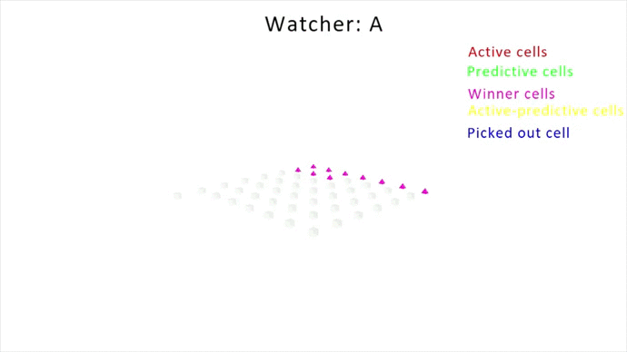

# Watcher

The purpose of this project is to create instruments for visualization [HTM models](https://github.com/htm-community/htm.core)
in 3D space.

At this moment it allows to see only TM models, but it is available to display all connections of the highlighted cell, 
each segment of this cell and cells belonging to the segment. 

The project uses Python 3.7 and [OpenGl](https://pypi.org/project/PyOpenGL/). For using download repository and install requirements:

```bash
pip install -r requirements.txt
``` 

## How it works

If you want to visualize your experiments with TM, you should make several steps.

### Preparation

Watcher uses JSON files as database, and so on this step you should create such file.
For this purpose there is `writer.py`. This utility will help you. For using it you 
need to have `writer.py` in the directory there you make your TM experiments. Then
you need to initialize class `Writer` after initializing of the TM model, which you want 
to display. After that use method `write` to record the state of the model after it make
computation step. If you want to label your step, you can use `write(text='some label')`.
And finally close record and save data in file by `save` method.

Example:
```python
from htm.bindings.sdr import SDR
from htm.algorithms import TemporalMemory as TM
from writer import Writer

input_sdr = SDR(input_size)

tm = TM(
    columnDimensions = (input_sdr.size,),
)
# initializing Writer
writer = Writer(tm)

for value, value_label in sequence:
    input_sdr.dense = encode_sdr_val(value)
    tm.compute(input_sdr, learn=learn)
    tm.activateDendrites(learn)
    # make the record
    writer.write(text=value_label)

# close after using and save to data.json file
writer.save('data.json')
```

### Visualization

Now you have your data in some JSON file (in my example data.json). And now 
place this file in data directory in the Watcher project. And the next step is
the last one, just launch `fly.py`:

Example:

```bash
python fly.py data.json
``` 
if you want to change the size of the window just use `--size` parameter.
```bash
python fly.py data.json --size 1280,720
``` 

## Control buttons

Movement:
- `W` - forward
- `S` - backward
- `A` - left
- `D` - right
- `Scroll` - for change velocity
- your cursor controls camera view
  - `LEFT SHIFT` or `MIDDLE BUTTON` unblock your camera
  
Special functions:
- `LEFT BUTTON` picks out cell there your cursor is
- `RIGHT BUTTON` picks out cell there your cursor is, use it only after `LEFT BUTTON`, if you want to see
 information about connection between this 2 picked out cells (synapse's permanence for 2nd cell) 
- `Q` - displays by different color cells belonging to different segments. 
Uses only if some cell is picked out.
- `E` - displays among segments the active segment. Uses only with `Q`
- `N` - make next step in data
- `P` - make previous step in data

Exit:
-`ESC` - close window

## Some remarks

In the data directory there are same datafiles, which you can use as examples.


